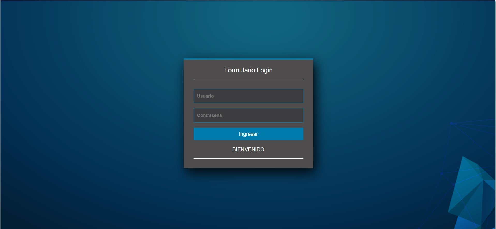
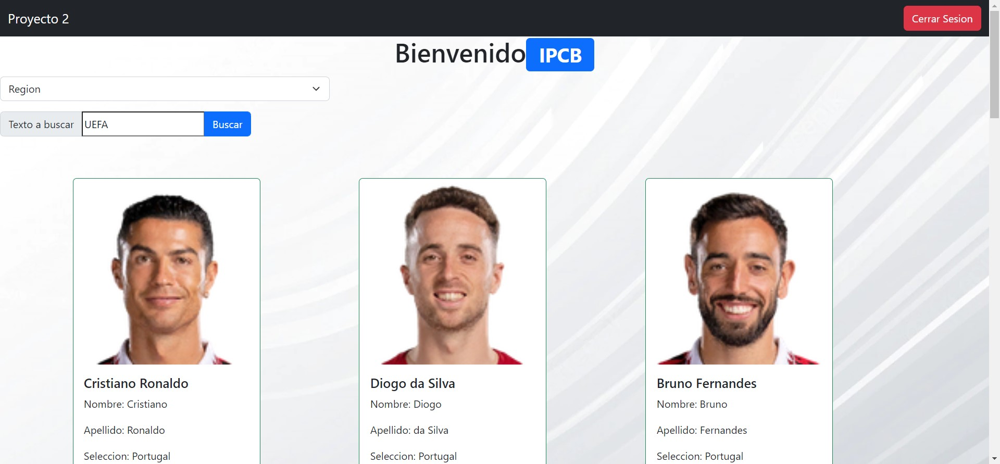

# **Proyecto 2** 

| Informacion   | Contenido                    |
|---------------| :---------                   |
|Carnet         | 202100316                    |
| Nombre        | Jose Andres Hinestroza Garcia|
|Auxiliar       |Javier Oswaldo Mirón Cifuentes|

## Fronted 

<p style='text-align: justify;'> Las tegnologias implementadas para el funcionamiento de Angular fue Anfular, en la cual es un framewrok de javascrip de codigo abierto escrito en Typescript, la cual nos ayuda desarrolar aplicaciones. Encargandose Google del mantenimiento y las mejoras del mismo. Ademas de su Angular cli el cual permite crear proyectos en los que el CLI podrá añadir archivos y más exactamente, entidades Angular. Será posible añadir módulos, componentes, servicios o directivas en una línea de comandos. Tambien contiene lenguaje en HTML y CSS, como tambien se utilizo Boostrap, para agregar las tarejtas y la barra de navegación</p>

### Servicios

<p style='text-align: justify;'> Los servicios responden a la entarda que interactuan con el modelo, es decir a los modelos de jugadores y de los usuarios los cual declaramos desde nuestro backend</p>

* Usuarios: en esto responde a todos los usuarios los cuales declaramos, en lso cuales usamos 2 predeterminados y uno agrado por mi.
* Jugadores: en esto responde a todos los jugadores en los cuales tambien tendremos que separarlos segun los endpoints declarados, los cuales se encuentran la region, seleccion, nombre y todos.

### Login 

<p style='text-align: justify;'> El login muestra una interfaz en la cual nos permite loguearnos con cualquiera de nuestros 3 diferentes usuarios. Asimismo nos mostrara cuando se ccuentren vacios los campos, o que el usuario o contraseña esten mal ingresados. </p>
 



### Menu

<p style='text-align: justify;'> Asimismo se presenta un menu en el cual podemos seleccionar de donde pais, region o nombre deseamos que se busque y un boton de cerrar cesion</p>



En la barra de donde podemos seleccionar que queremos buscar si es Region, Selccion o Nombre, ademas de contar con una texto en la cual nos permite buscar por tecto los diferentes datos que nosotros deseamos buscar. Contando tambien con un boton del cierre de sesion.

## Backend

<p style='text-align: justify;'> Se implemento la tegnologia Node JS, la cual nos permite ejecutar JavaScript sin necesidad de un navegador web. Ademas de que podemos instalarlo y ejecutarlo en dieferentes sistemas operativos. Esta posee ciertas herramienras en la cual nos dan acceso al sistema, esto nos permite que podamos ejecutar JavaScript en un servidor, server, la cual nos permite intercambiar informacio, Backend, </p>

### Endpoints

<p style='text-align: justify;'> A continuacion se meustran los endpiont en los cuales se accedera a la informacion desde la API_URI para que se puedan compartir informacion </p>

* Todos llama a todos los jugadores agregados, es decir a los 20 jugadores con 5 diferentes selecciones
* Nombre/Nombre llama al nombre y recibe como parametro un String en el cual podemos declarar cual es jugador especifico a llamar
* Seleccion/Seleccione llama al nombre y recibe como parametro un String en el cual podemos declarar cual es jugador especifico a llamar
* Region/Region llama al nombre y recibe como parametro un String en el cual podemos declarar cual es jugador especifico a llama

A continuacion se presenta en codigo los endpois en los cuales se les hace el llamado a cada uno de los parametros a llamar 

```
config(): void {
        
        this.router.get('/Nombre/:Nombre', (req, res) => {
            const jugadorn = this.infojugador(req.params.Nombre, 1)
            res.send(jugadorn); // se debe mandar parametro para saber que se quiere mandar
        });
        this.router.get('/Seleccion/:Seleccion', (req, res) => {
            const jugadorn = this.infojugador(req.params.Seleccion, 2)
            res.send(jugadorn); // se debe mandar parametro para saber que se quiere mandar
        });
        this.router.get('/Region/:Region', (req, res) => {
            const jugadorn = this.infojugador(req.params.Region, 3)
            res.send(jugadorn); // se debe mandar parametro para saber que se quiere mandar
        });
    }
```